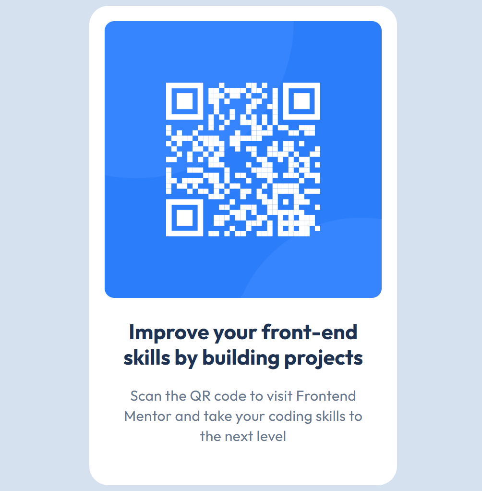

# Frontend Mentor - QR code component solution

This is a solution to the [QR code component challenge on Frontend Mentor](https://www.frontendmentor.io/challenges/qr-code-component-iux_sIO_H). Frontend Mentor challenges help you improve your coding skills by building realistic projects.

## Table of contents

- [Overview](#overview)
  - [Screenshot](#screenshot)
  - [Links](#links)
- [My process](#my-process)
  - [Built with](#built-with)
  - [What I learned](#what-i-learned)
  - [Continued development](#continued-development)
  - [AI Collaboration](#ai-collaboration)
- [Author](#author)

## Overview

### Screenshot



### Links

- Solution URL: https://www.frontendmentor.io/solutions/qr-component-AvRaPAggkz
- Live Site URL: https://fm-qr-code-componentaxmerko-hav09znil-axmerko.vercel.app/

## My process

### Built with

- Semantic HTML5 markup
- CSS custom properties
- Flexbox
- Mobile-first workflow

### What I learned

On this first challenge I practiced fundamentals I'll use all the time:

- **Centering the card both vertically and horizontally** with Flexbox:

```css
body {
  display: flex;
  justify-content: center;
  align-items: center;
  min-height: 100vh;
}
```
- Using CSS custom properties for the colors and fonts from `style-guide.md`, so they live in one place and are easy to change.
- Building the card: constraining the width, rounding corners with `border-radius`, and spacing the content with padding.


### Continued development

I want to go deeper into CSS Grid and responsive layouts, and gradually move from writing styles by hand to Tailwind in React.

### AI Collaboration

I intentionally built this challenge by hand to practice plain CSS and rely less on AI. I only used AI (Claude) to review my code and explain concepts, not to generate the whole solution.

## Author

- GitHub - [@Axmerko](https://github.com/Axmerko)
- Frontend Mentor - [@Axmerko](https://www.frontendmentor.io/profile/Axmerko)